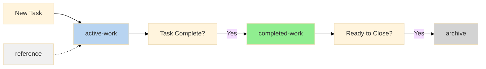
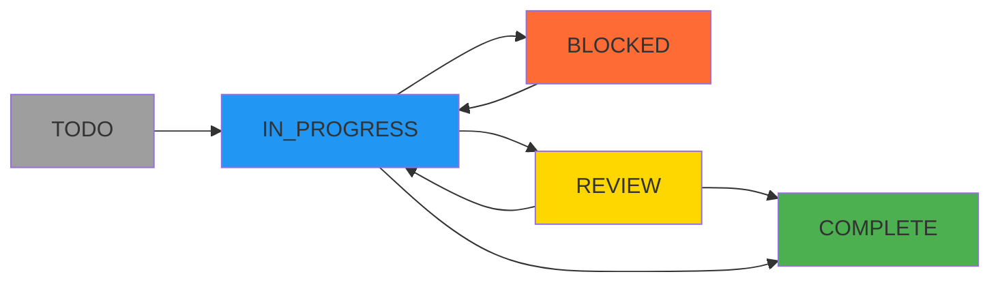
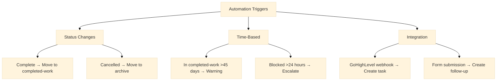
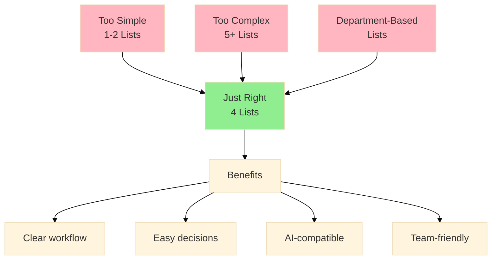
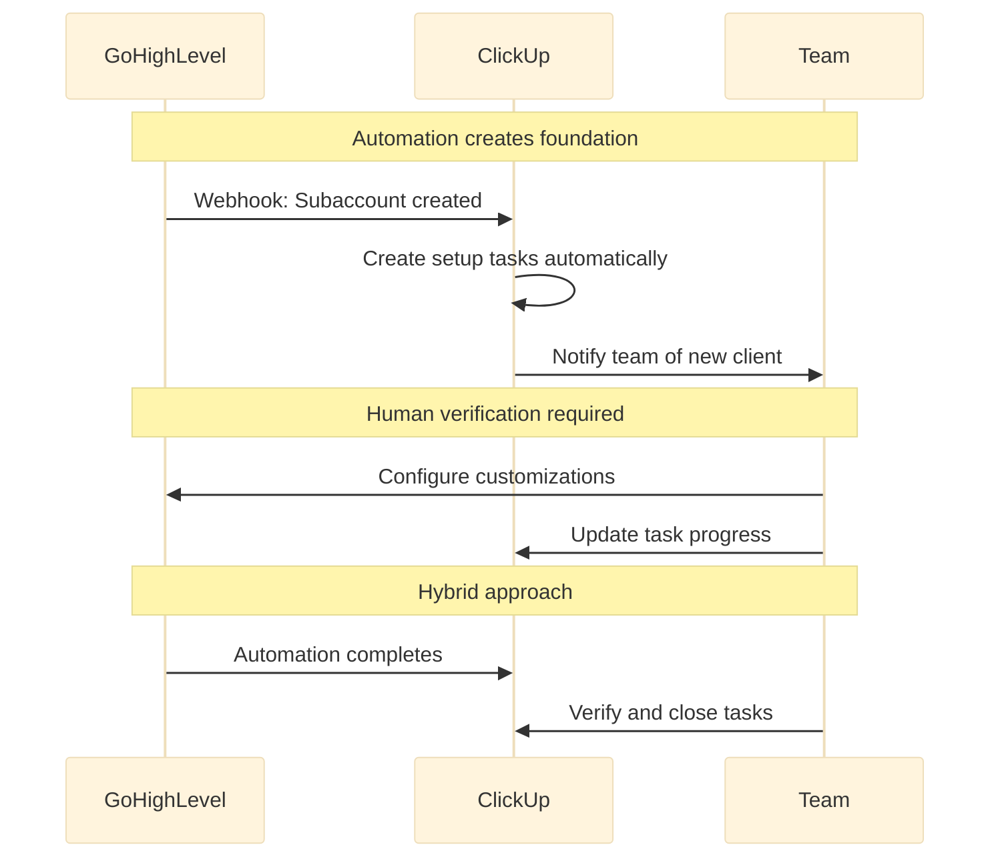
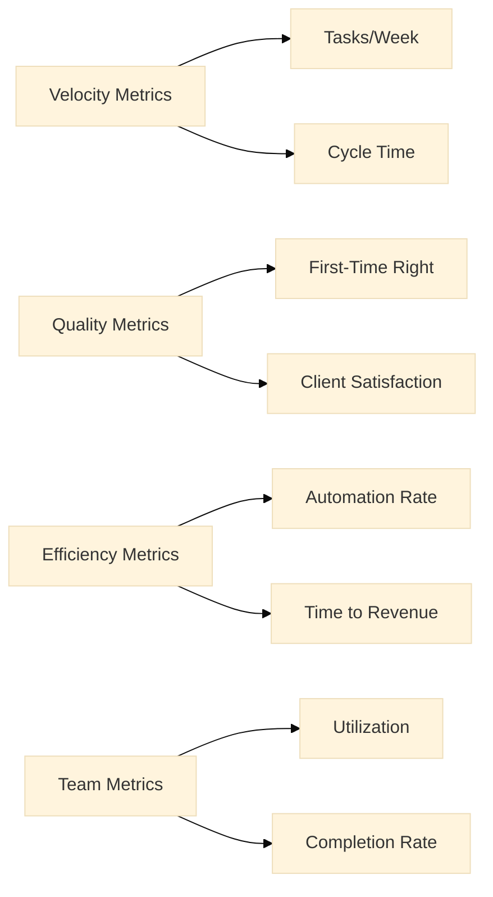

# ClickUp Client Delivery Process and Workflow Standard

---
title: ClickUp Client Delivery Process and Workflow Standard
version: 2.0
author: Symphony Core Systems Team
last_updated: 2025-01-03
category: Process
tags: [clickup, client-delivery, workflow, task-management, automation]
status: approved
reviewers: [operations-team, clickup-admin]
next_review: 2025-04-03
---

## Purpose

Defines the standardized structure, workflow, and operational processes for managing client delivery projects within ClickUp. This standard ensures consistency, scalability, team collaboration, and AI-tool compatibility while maintaining simplicity.

## Scope

This document covers all aspects of client project management in ClickUp, including folder structure, task workflows, team collaboration, and administrative configurations.

---

# SECTION 1: TEAM GUIDE
*Essential information for all team members*

## Our Client Delivery Structure

### Simple 4-List System

Every client has one folder with exactly four lists:

```
Client Delivery (Space)/
└── [client-name] (Folder)
    ├── active-work        # What we're doing now
    ├── completed-work     # What we've accomplished (celebrating wins!)
    ├── archive           # Closed and documented
    └── reference         # Resources and documentation
```

### Where Tasks Go



**active-work:** Currently working on it
**completed-work:** Done! Time logged, celebrating achievement
**archive:** All wrapped up and documented
**reference:** Info we need to keep handy

## Writing Effective Tasks

### Task Naming Convention

Always use: `[action-verb]-[component]-[specific-item]`

✅ **Good Examples:**
- `setup-gohighlevel-subaccount`
- `configure-email-automation`
- `fix-contact-form-validation`

❌ **Avoid:**
- `Website updates` (too vague)
- `GHL` (no action verb)
- `Email John about the thing` (not structured)

### Task Description Template

Every task should include:

```markdown
## Objective
[One clear sentence about what needs to be done]

## Acceptance Criteria
- [ ] Specific outcome 1
- [ ] Specific outcome 2
- [ ] Specific outcome 3

## Resources
- Google Drive: Client_Delivery/[client-name]-2025/
- GoHighLevel: [Specific location/workflow]
- Related tasks: #[task-id]
```

### Subtask Guidelines

**Maximum Depth: 2 Levels**

```
Task (Level 0)
├── Subtask (Level 1)
│   └── Sub-subtask (Level 2) ← STOP HERE
```

**When to Use Subtasks:**
- Breaking down work that takes >4 hours
- Tracking distinct deliverables within a task
- Creating checkpoints for review

**When NOT to Use Subtasks:**
- Simple checklist items (use description checkboxes instead)
- Tasks that take <1 hour
- Repeating the same action multiple times

## Task Lifecycle for Team Members

### Your Daily Workflow

1. **Start of Day:** Check `active-work` list
2. **During Work:** Update task status and log time
3. **Task Complete:** Move to `completed-work` with time logged
4. **End of Day:** Update all task statuses

### Status Meanings

| Status | What It Means | Your Action |
|--------|--------------|-------------|
| TODO | Ready to start | Pick it up when ready |
| IN PROGRESS | You're working on it | Keep us updated |
| BLOCKED | Can't proceed | Add comment explaining why |
| REVIEW | Needs checking | Tag reviewer |
| COMPLETE | All done! | Move to completed-work |





### Time Logging Requirements

**Every billable task needs:**
- Accurate time tracked (use timer or manual entry)
- Work description in time entry
- Task moved to `completed-work` when done

**Non-billable tasks:**
- Mark with `#non-billable` tag
- Can skip directly to `archive` when complete

## Example: Well-Written Task with Subtasks

```yaml
Task: setup-wordpress-website-homepage
Status: IN PROGRESS
Assignee: Sarah Developer
Due: 2025-01-15
Priority: High
Tags: client-acme, website, setup
Custom Fields:
  Client: ACME Corp
  Delivery Role: Developer
  Billable: Yes

Description: |
  ## Objective
  Set up and launch the WordPress homepage with all required sections
  
  ## Acceptance Criteria
  - [ ] Homepage loads correctly on desktop and mobile
  - [ ] All 5 sections implemented per design
  - [ ] Contact form tested and working
  - [ ] Page speed score >90
  
  ## Resources
  - Google Drive: Client_Delivery/acme-corp-2025/website-design/
  - Staging site: https://staging.acmecorp.com
  - Design mockups: Figma link
  
Subtasks:
  1. implement-hero-section
     Status: COMPLETE
     Time: 2 hours
     Description: Hero with CTA button
     
  2. configure-contact-form
     Status: IN PROGRESS
     Time: 1 hour estimated
     Description: Form with email notification
     Subtasks:
       - create-form-fields (COMPLETE)
       - setup-email-routing (TODO)
       - test-form-submission (TODO)
       
  3. optimize-page-speed
     Status: TODO
     Time: 1 hour estimated
     Description: Achieve >90 PageSpeed score
```

---

# SECTION 2: ADMIN CONFIGURATION
*For ClickUp workspace administrators only*

## Workspace Setup Requirements

### Required Custom Fields

Configure these at the Space level for inheritance:

```yaml
Custom Fields Configuration:
  
  Client:
    Type: Dropdown
    Required: Yes
    Options: [Dynamic list matching Google Drive client folders]
    Description: Must match Google Drive naming exactly
    
  Delivery Role:
    Type: Dropdown
    Required: Yes
    Options:
      - Project Manager
      - Developer
      - Account Manager
      - Marketing Specialist
      - Content Creator
      - Automation Specialist
      - Support Specialist
    Description: Primary role responsible for task
    
  Billable:
    Type: Dropdown
    Required: Yes
    Options: [Yes, No, N/A]
    Default: Yes
    Description: Determines payment workflow routing
    
  Invoice Number:
    Type: Text
    Required: No
    Format: INV-YYYY-MM-###
    Description: Links to accounting system
    
  Time Verified:
    Type: Checkbox
    Required: No
    Description: Manager verification of logged time
```

### Automation Rules



**Required Automations to Configure:**

1. **Auto-Move on Complete:**
   - Trigger: Status changes to COMPLETE
   - Action: Move to `completed-work` list
   - Condition: If billable = Yes

2. **Non-Billable Fast Track:**
   - Trigger: Status = COMPLETE AND tag = #non-billable
   - Action: Move directly to `archive`

3. **Stale Task Warning:**
   - Trigger: Task in `completed-work` >45 days
   - Action: Add tag "⏰ NEEDS CLOSURE"
   - Notify: Project Manager

4. **GoHighLevel Integration:**
   - Webhook endpoint: `/clickup/webhook/ghl`
   - Events: Subaccount created, Snapshot deployed
   - Action: Create task in `active-work`

### List Configurations

```yaml
active-work:
  Statuses: [TODO, IN PROGRESS, BLOCKED, REVIEW, COMPLETE]
  Default View: Kanban by Status
  Sorting: Priority → Due Date
  
completed-work:
  Statuses: [COMPLETE, TIME_LOGGED, VERIFIED, READY_TO_CLOSE]
  Default View: List by Date Completed
  Sorting: Date Completed (Newest First)
  
archive:
  Statuses: [ARCHIVED, CANCELLED]
  Default View: List
  Sorting: Date Archived
  Permissions: Read-only for non-admins
  
reference:
  Statuses: [ACTIVE, OUTDATED]
  Default View: Board by Type
  Categories: [Credentials, Documentation, Templates, Meetings]
```

### Permission Settings

| Role | active-work | completed-work | archive | reference |
|------|------------|---------------|---------|-----------|
| Admin | Full | Full | Full | Full |
| Project Manager | Full | Full | Read | Full |
| Team Member | Create/Edit Own | Create/Edit Own | Read | Read |
| Contractor | Create/Edit Own | Create/Edit Own | None | Read |
| Client | Comment Only | None | None | None |

### Monthly Maintenance Tasks

**First Monday of Month:**
- Archive tasks from `completed-work` older than 60 days
- Export archive data to Google Drive
- Clean up cancelled/obsolete tasks
- Update Client dropdown field options

**Mid-Month:**
- Review automation performance
- Check for stuck tasks in `completed-work`
- Validate time logging compliance
- Update team on any process changes

---

# SECTION 3: DESIGN PRINCIPLES
*Why we built it this way*

## Core Design Decisions

### Why Four Lists?

We tested multiple configurations and found that four lists provides the optimal balance:



**Rejected Approaches:**
- ❌ **Department lists** (web-dev, marketing, ops) - Creates silos
- ❌ **Phase lists** (discovery, setup, launch) - Not all clients follow same phases
- ❌ **Priority lists** (urgent, normal, low) - Priorities change too often

**Why This Works:**
- ✅ **Workflow-based** - Matches how work actually flows
- ✅ **Universal** - Works for all client types and sizes
- ✅ **Simple** - Team members know exactly where tasks go
- ✅ **Scalable** - Same structure for 1 or 100 clients

### Why "completed-work" Instead of "pending-payment"?

**Cultural Decision:**
- Celebrates achievement rather than emphasizing transactions
- Makes contractors feel valued for their contributions
- Creates positive team dynamics
- Administrative process happens in background

**Practical Benefits:**
- Same workflow for billable and non-billable tasks
- Reduces friction in task movement
- Clear accomplishment visibility
- Easier to track team velocity

### Why Two Levels of Subtasks Maximum?

**Cognitive Load:**
- Human brain handles 2 levels easily
- 3+ levels create navigation confusion
- Flatter structure improves visibility

**Tool Compatibility:**
- Most integrations only read 2 levels
- AI tools struggle with deep nesting
- Export/import maintains structure

**Practical Experience:**
- Tasks needing 3+ levels should be separate tasks
- Deep hierarchies hide important work
- Flat structure encourages better task definition

## Integration Philosophy

### GoHighLevel Integration Points



**Design Principle:** Automation assists, humans verify

### AI Tool Compatibility

**Structured for AI Success:**
- Consistent naming = AI can predict patterns
- Fixed list structure = No complex decisions
- Clear field definitions = Accurate data entry
- Standard templates = Reliable task creation

**Example AI Instruction:**
"Create a task in active-work list for setting up email automation. Use standard template. Client is ACME Corp. Assign to Marketing Specialist role."

## Metrics That Matter

### What We Track



### What We DON'T Track
- Individual task counts (creates wrong incentives)
- Time per task comparisons (every task is different)
- List-to-list movement speed (quality over speed)

## Evolution Path

### Current State (v2.0)
- Manual task creation with templates
- Basic GoHighLevel webhooks
- Manual time verification

### Next Quarter (v2.1)
- AI-assisted task creation
- Automated time verification
- Advanced GHL integration

### Future Vision (v3.0)
- Predictive task generation
- Automatic resource allocation
- Full workflow automation

---

## Appendices

### A. Quick Reference Card

```
Task goes in → active-work
Task complete → completed-work  
Time verified → stays in completed-work
Monthly cycle → archive
Information → reference
```

### B. Common Scenarios

**Scenario: Emergency task during weekend**
- Create in `active-work` with #urgent tag
- Skip normal workflow if needed
- Document exception in task

**Scenario: Task spans multiple months**
- Keep in `active-work` until fully complete
- Log time monthly
- Add note about multi-month span

**Scenario: Client-created request**
- Lands in `active-work` automatically
- Team member claims and clarifies
- Follows normal workflow

### C. Rollout Timeline

**Week 1:** Structure setup for new clients
**Week 2:** Migrate existing clients
**Week 3:** Team training and practice
**Week 4:** Full implementation
**Week 5+:** Monitor and optimize

---

**Questions?** Contact ClickUp Admin or Symphony Core Systems Team
**Training Videos:** Available in reference list under "ClickUp Training"
**Updates:** This document is reviewed quarterly and updated as needed