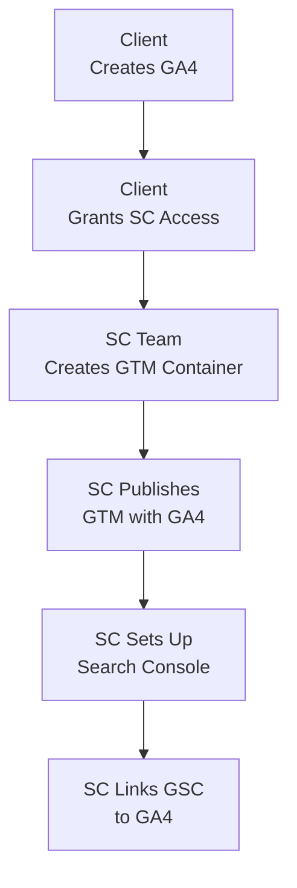

# SOP – Analytics Integration (GTM + GSC)

## Purpose

Describes the post-GA4 integration steps executed by Symphony Core to enable tracking, tagging, and reporting across Google Tag Manager and Google Search Console.

---

## Metadata

* **Category**: SOP
* **Tags**: \[GTM, GSC, Analytics Integration, GA4]
* **Author**: Symphony Core Analytics Team
* **Reviewed By**: \[Reviewer Name]
* **Status**: Draft
* **Location**: \[Drive Path or URL]

---

## Scope

Covers internal actions taken by Symphony Core once the client has created and granted access to the GA4 account.

---

## Visual Overview

---

## Step-by-Step Procedure

### Step 1 – GTM Container Creation

* Create using `setup@symphonycore.com`
* Name container using client's website URL
* Install tracking code on client site
* Verify installation via GTM Preview mode

### Step 2 – GA4 Tag Configuration

* Use client's GA4 Measurement ID
* Create GA4 Configuration tag
* Trigger: All Pages
* Validate using GTM Preview and GA4 DebugView
* Publish container

### Step 3 – GSC Setup

* Create account using `setup@symphonycore.com`
* Add website property
* Verify ownership via GA4 verification
* Submit XML sitemap

### Step 4 – Link GSC to GA4

* Navigate to GA4 Admin > Product Links > Search Console Links
* Link verified GSC property
* Enable Search Console reports in GA4

---

## Required Inputs

* Client's GA4 Measurement ID
* Website backend access for GTM code placement
* Valid XML sitemap URL

---

## Expected Outputs

* GTM container tracking GA4 events
* GSC verified and sitemap submitted
* GA4 and GSC integration complete

---

## Exceptions & Edge Cases

* If GTM installation is blocked, coordinate with client's web developer
* If GSC GA4 verification fails, use DNS or HTML file verification
* For cross-domain tracking, configure additional GTM settings

---

## Ownership & Review

* **SOP Owner**: Symphony Core Analytics Team Lead
* **Last Reviewed**: 2025-07-10
* **Next Review Due**: 2025-10-10
* **Review Cadence**: Quarterly
* **Related SOPs**:

  * SOP – GA4 Account Creation (Client-Owned)

---
