```mermaid
graph LR
    %% ============================================================================
    %% NODE DEFINITIONS
    %% ============================================================================
    
    %% Imported Snapshots
    imported-snapshot1["Universal Small Business<br/>By Extendly | 07/29/2025<br/>V2.4.2"]
    
    %% Subaccounts
    seed-subaccount2["z Universal Small Business<br/>| By Extendly"]
    subaccount2["z.sc Real Estate Base"]
    seed-subaccount1["z.sc Seed"]
    subaccount5["z.sc Prof-Services Base"]
    subaccount6["z Real Estate Demo"]
    subaccount7["MCG REAL ESTATE"]
    subaccount8["Southbury Plaza"]

    subaccount9["z.sc non-US Base"]
    subaccount10["z.sc Non-US Small Biz Base"]
    subaccount11["Upscale Legal"]
    subaccount12["z.sc Ecommerce Base"]

    subaccount14["z.sc Small Biz Base"]
    subaccount15["z.sc Small Biz Demo"]
    subaccount16["z.sc Small Biz Development"]
    subaccount17["z.sc E-Learning Base"]
    subaccount18["Open Wize"]
    subaccount19["z.sc Law Firm Demo"]




    %% Snapshots
    snapshot2["z.sc.Real-Estate-2025-10-04-v1"]
    snapshot3["z.sc.Real-Estate-Base-2025-10-06-v1"]
    seed-snapshot1["z.sc.Base-2025-10-10-v1"]
    snapshot5["z.sc.Prof-Services-2025-10-07-v1"]
    base-snapshot6["z.sc.Prof-Services-Base-2025-10-16-v1"]
    snapshot7["z.sc.non-US.Base-2025-10-10-v1"]
    snapshot8["z.sc.Small-Biz-2025-10-10-v1"]
    snapshot9["z.sc.non-US-Small-Biz-Base-2025-10-10-v1"]
    snapshot10["z.sc.non-US-2025-10-10-v1"]
    snapshot11["z.sc.Ecommerce-2025-10-10-v1"]
    base-snapshot9["z.sc.Ecommerce.Base-2025-10-27-v1"]
    base-snapshot8["z.sc.Small-Biz-Base-2025-10-15-v1"]
    snapshot12["z.sc.E-Learning-2025-11-01-v1"]
    base-snapshot10["z.sc.E-Learning-Base-2025-11-01-v1"]


    %% ============================================================================
    %% RELATIONSHIPS
    %% ============================================================================
    
    %% Primary Flow
    imported-snapshot1 --> seed-subaccount2
    
    %% Real Estate Branch
    seed-subaccount2 --> snapshot2
    snapshot2 --> subaccount2
    subaccount2 --> snapshot3
    snapshot3 --> subaccount6
    snapshot3 --> subaccount7
    snapshot3 --> subaccount8

    
    %% Base Branch
    seed-subaccount1 --> seed-snapshot1
    seed-snapshot1 --> subaccount2
    
    %% Professional Services Branch
    seed-subaccount2 --> snapshot5
    seed-snapshot1 --> subaccount5
    snapshot5 --> subaccount5
    subaccount5 --> base-snapshot6

    %% Non US
    seed-subaccount2 --> snapshot7
    seed-snapshot1 --> subaccount9
    subaccount9 --> snapshot10
    snapshot10 --> subaccount10


    %% Small Biz 
    seed-subaccount2 --> snapshot8
    snapshot8 --> subaccount14
    seed-snapshot1 --> subaccount14
    subaccount14 --> base-snapshot8
    base-snapshot8 --> subaccount15
    base-snapshot8 --> subaccount16



    subaccount10 --> snapshot9
    snapshot7 --> subaccount10
    snapshot9 --> subaccount11


    %% Ecommerce
    seed-subaccount2 --> snapshot11
    snapshot11 --> subaccount12
    seed-snapshot1 --> subaccount12
    subaccount12 --> base-snapshot9

    %% E-Learning
    seed-subaccount2 --> snapshot12
    snapshot12 --> subaccount17
    seed-snapshot1 --> subaccount17
    subaccount17 --> base-snapshot10
    base-snapshot10 --planned--> subaccount18


    %% Prof Services
    base-snapshot6 --> subaccount19






    %% ============================================================================
    %% STYLE DEFINITIONS
    %% ============================================================================
    
    classDef importedSnapshot fill:#fff,stroke:#000000,stroke-width:3px,color:#000
    classDef subAccount fill:#fff,stroke:#F57F17,stroke-width:2px,color:#000
    classDef snapshot fill:#007F46,stroke:#000000,stroke-width:2px,color:#000
    classDef mix-subaccount fill:#00FF00,stroke:#F57F17,stroke-width:2px,color:#000
    classDef industry-sc-base-snapshot fill:#00FF00,stroke:#000000,stroke-width:2px,color:#000
    classDef base-snapshot fill:#FFE57F,stroke:#000000,stroke-width:2px,color:#000
    classDef base-industry-snapshot fill:#FFE57F,stroke:#000000,stroke-width:3px,color:#000
    classDef sc-base-subaccount fill:#0000FF,stroke:#F57F17,stroke-width:2px,color:#fff
    classDef industry-snapshot fill:#FFFF00,stroke:#000000,stroke-width:2px,color:#000
    classDef sc-snapshot fill:#0000FF,stroke:#000000,stroke-width:2px,color:#fff

    classDef client-subaccount fill:#20B2AA,stroke:#F57F17,stroke-width:2px,color:#000
    classDef demo-subaccount fill:#CCFFCC,stroke:#F57F17,stroke-width:2px,color:#000


    %% ============================================================================
    %% STYLE APPLICATIONS
    %% ============================================================================
    
    class imported-snapshot1 importedSnapshot
    class seed-subaccount2 subAccount

    class snapshot2,snapshot5,snapshot7,snapshot8,snapshot11,snapshot12 industry-snapshot

    class subaccount2,subaccount5,subaccount10,subaccount14,subaccount12,subaccount17 mix-subaccount
    class seed-subaccount1,subaccount9 sc-base-subaccount


    class snapshot3,base-snapshot6,snapshot9,base-snapshot8,base-snapshot9,base-snapshot10 industry-sc-base-snapshot


    class seed-snapshot1,snapshot10 sc-snapshot


    class subaccount6,subaccount15,subaccount19 demo-subaccount
    class subaccount7,subaccount8,subaccount11,subaccount18 client-subaccount
```

---

## Legend / Key

### Node Types by Border Color

- **Orange Border (#F57F17)** = Sub-Accounts
- **Black Border** = Snapshots

### Snapshots (Black Border)

| Color | Hex Code | Type | Description |
|-------|----------|------|-------------|
| White (thick 3px) | #FFFFFF | Imported | Third-party snapshot from provider |
| Yellow | #FFFF00 | Industry | Industry-specific snapshot from Extendly |
| Blue | #0000FF | SC/Universal Base | Symphony Core customization snapshot (includes Universal Base from z.sc Seed) |
| Tan | #FFE57F | Base | Intermediate base snapshot |
| Green | #00FF00 | Industry-SC-Base | Final deployment-ready base (Yellow + Blue) |

### Sub-Accounts (Orange Border)

| Color | Hex Code | Type | Description |
|-------|----------|------|-------------|
| White | #FFFFFF | Import/Seed | Import or seed sub-accounts |
| Blue | #0000FF | SC Base | SC customization workspace |
| Green | #00FF00 | Mix Base | Contains both SC + Industry content |
| Light Green | #CCFFCC | Demo | Demonstration sub-account |
| Teal | #20B2AA | Client | Live production client sub-account |

### Core Principle: Yellow + Blue = Green

- **Yellow** = Industry-specific content (from Extendly import)
- **Blue** = Symphony Core (SC) customizations (agency-level features)
- **Green** = Combined base (both Industry + SC together, ready for deployment)

### Border Distinction

- **3px thick border** = Imported snapshots only
- **2px standard border** = All other snapshots and sub-accounts