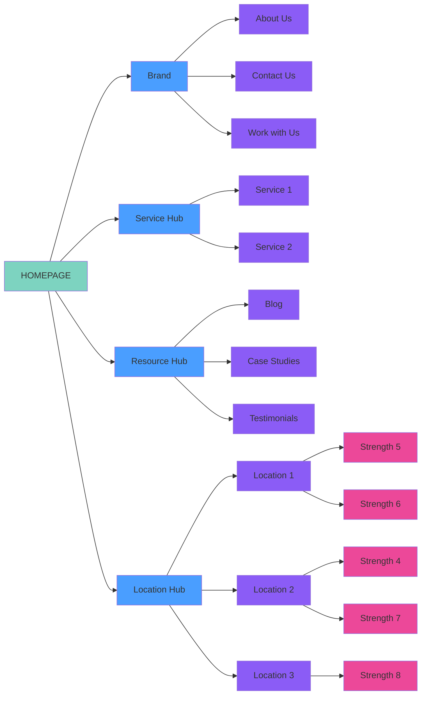

# SC Local Business Website Structure Guide

## Overview

This guide outlines the standard website structure for Symphony Core local business websites. The structure is designed to provide optimal user experience, clear navigation, and effective organization of business information across different content categories.

## Structure Philosophy

The website structure follows a hub-based organizational model where content is logically grouped into four main categories (hubs). These hubs are **conceptual groupings** rather than actual pages, serving to organize the site's information architecture.

## Core Structure Elements

### Homepage
The central landing page that connects to all main content areas and provides the primary entry point for visitors.

### Four Content Hubs

1. **Brand Hub** - Company identity and relationship pages
2. **Service Hub** - Service offerings and capabilities
3. **Resource Hub** - Educational and trust-building content
4. **Location Hub** - Geographic presence and local market information

### Page Hierarchy

## Detailed Structure Breakdown

### Brand Hub
**Purpose**: Establish company identity and facilitate customer relationships

- **About Us**: Company history, mission, values, team
- **Contact Us**: Contact information, forms, office details
- **Work with Us**: Career opportunities, partnerships, vendor information

### Service Hub
**Purpose**: Present business offerings and capabilities

- **Service 1**: Primary service offering with detailed information
- **Service 2**: Secondary service offering with detailed information
- *Note: Additional services can be added as needed (Service 3, 4, etc.)*

### Resource Hub
**Purpose**: Provide valuable content that builds trust and demonstrates expertise

- **Blog**: Regular content updates, industry insights, company news
- **Case Studies**: Detailed project examples and success stories
- **Testimonials**: Client feedback and reviews

### Location Hub
**Purpose**: Address geographic markets and local presence

- **Location 1/2/3**: Individual location pages for different geographic markets
- **Strength Items**: Specific local advantages, partnerships, or capabilities unique to each location

## Implementation Guidelines

### Navigation Structure
- Hubs should be reflected in main navigation categories
- Sub-pages should be accessible through dropdown menus or section navigation
- Breadcrumb navigation should reflect the hub structure

### Content Strategy
- Each hub should have consistent design and layout patterns
- Cross-linking between hubs should be strategic and purposeful
- Local content should be tailored to specific geographic markets

### SEO Considerations
- Hub structure supports topic clustering for improved search performance
- Location pages enable local SEO optimization
- Resource hub provides ongoing content marketing opportunities

## Customization Notes

- Service offerings can be expanded beyond the basic two services shown
- Location hubs can be scaled based on business geographic footprint
- Strength items under locations should reflect actual local competitive advantages
- Additional resource types can be added to the Resource Hub as needed

This structure provides a scalable, organized foundation for local business websites that supports both user experience and business objectives.